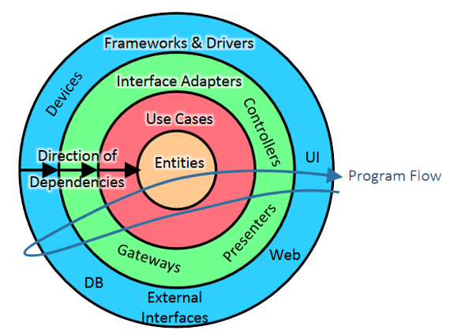

# clean-arch-ts

<p align="center">
  <br>
</p>
<p align="center">
  <a href="#about-this-template">About this template</a> •
  <a href="#structure">Structure</a> •
  <a href="#how-it-works">How It Works</a> •
  <a href="#installation">Installation</a> •
  <a href="#di-usage">DI usage</a> •
  <a href="#multi-stage-dockerfile">Dockerfile</a><br>
</p>

## About this template
Lightweight clean architecture template.

### What's included?
- 🖼️ Clean architecture principles
- ʦ nodeJs + TypeScript
- 📦 DI container ([tsyringe](https://github.com/microsoft/tsyringe))
- :whale: Multi stage lightweight Dockerfile 
- :octocat: GitHub workflows
- 🔧 Makefile
- 📋 Pull-Request template

## Structure
Directory structure proposal:

```text
📦src
 ┣ 📂delivery
 ┃ ┗ ...
 ┣ 📂domain
 ┃ ┣ 📂entities
 ┃ ┃ ...
 ┃ ┣ 📂repositories
 ┃ ┃ ...
 ┃ ┗ 📂useCases
 ┃ ┃ ...
 ┗ 📂infrastructure
 ┃ ┣ 📂clients
 ┃ ┃ ...
 ┃ ┣ 📂controllers
 ┃ ┃ ...
 ┃ ┣ 📂repositories
 ┃ ┃ ...
 ┃ ┣ 📜config.ts
 ┃ ┗ 📜register.ts
```

## How it works


## Installation

```bash
❯ make install
❯ make build
```

## The Makefile

```bash
❯ make
Usage: make <target>

Targets:
help:                   ## Show the help.
build:                  ## Build the project.
start:                  ## Run start script.
docker-build:           ## Build docker image.
clean:                  ## Remove node_modules.
install:                ## Install packages.
```


## DI usage

> Dependency injection (DI) is a programming technique that makes a class independent of its dependencies. 
> It achieves that by decoupling the usage of an object from its creation. 
> This helps you to follow SOLID's dependency inversion and single responsibility principles.

In the infrastructure layer you can find the DI container register where dependency injection rules are defined using
[tsyringe package](https://github.com/microsoft/tsyringe) for constructor injection.

### Multiple dependencies
```ts
container.registerSingleton('HttpClient', FakeHttpClient)
container.registerSingleton('ModelProvider', HttpModelProvider)

if (isLocal) {
    container.registerSingleton('SuggestionsProvider', InMemorySuggestionsProvider)
} else {
    container.registerSingleton('DynamoDbClient', FakeDynamoDbClient)
    container.registerSingleton('SuggestionsProvider', DynamoSuggestionsProvider)
}


container.register('SuggestionController', SuggestionController)

container.register('MakeSuggestion', MakeSuggestion)
container.register('GetSuggestions', GetSuggestions)
```

Let's simulate that we want to run the code with the local implementation of SuggestionsProvider.

The `start:local` script in package.json set the environment to `local`, so the register with inject local InMemory implementation instead of DynamoDb one.

Running `❯ npm run start:local` will output something like:

```bash
> clean-arch-ts@1.0.0 start:local
> ENVIRONMENT=local node .

[InMemorySuggestionsProvider] addOne() Suggestion { userId: 3, date: 2022-08-25T18:31:19.203Z, value: 27 }
[InMemorySuggestionsProvider] addOne() Suggestion { userId: 3, date: 2022-08-25T18:31:19.203Z, value: 12 }
[InMemorySuggestionsProvider] addOne() Suggestion { userId: 3, date: 2022-08-25T18:31:19.203Z, value: 9 }
[InMemorySuggestionsProvider] getFor() {
  userId: 3,
  start: 2022-08-24T00:00:00.000Z,
  end: 2022-08-26T00:00:00.000Z
}
getSuggestions() for  3 [
  Suggestion { userId: 3, date: 2022-08-25T18:31:19.203Z, value: 27 },
  Suggestion { userId: 3, date: 2022-08-25T18:31:19.203Z, value: 12 },
  Suggestion { userId: 3, date: 2022-08-25T18:31:19.203Z, value: 9 }
]
```

Otherwise, the DI registry will set the external provider implementation.

Running `❯ npm run start` will output something like:

```bash
> clean-arch-ts@1.0.0 start
> node .

[DynamoSuggestionsProvider] addOne() Suggestion { userId: 3, date: 2022-08-25T18:31:55.075Z, value: 24 }
[DynamoSuggestionsProvider] addOne() Suggestion { userId: 3, date: 2022-08-25T18:31:55.075Z, value: 18 }
[DynamoSuggestionsProvider] addOne() Suggestion { userId: 3, date: 2022-08-25T18:31:55.075Z, value: 9 }
[DynamoSuggestionsProvider] getFor() {
  userId: 3,
  start: 2022-08-24T00:00:00.000Z,
  end: 2022-08-26T00:00:00.000Z
}
getSuggestions() for  3 []
```

## Multi-stage Dockerfile
Using multi-stage and final from scratch the total image size was reduced to ~40MB.

Let's make a comparative table:


* The first tag, `:large`, is a single-stage container file (building and running at the same stage) using the official `node:14` image as a base. **1.04GB**
* In the second one, `:large-alpine`, we improve a bit the size using `node:14-alpine` as a base. **271MB**
* The third one, `:multi-stage-alpine`, use the multi-stage strategy, splitting builder and final stages, using `node:14-alpine` as a base for both. **118MB**
* And the last one, `:multi-stage-small`, is the same multi-stage container file but using the [scratch-node](https://github.com/astefanutti/scratch-node/pkgs/container/scratch-node) minified image as final. **39.8MB**
